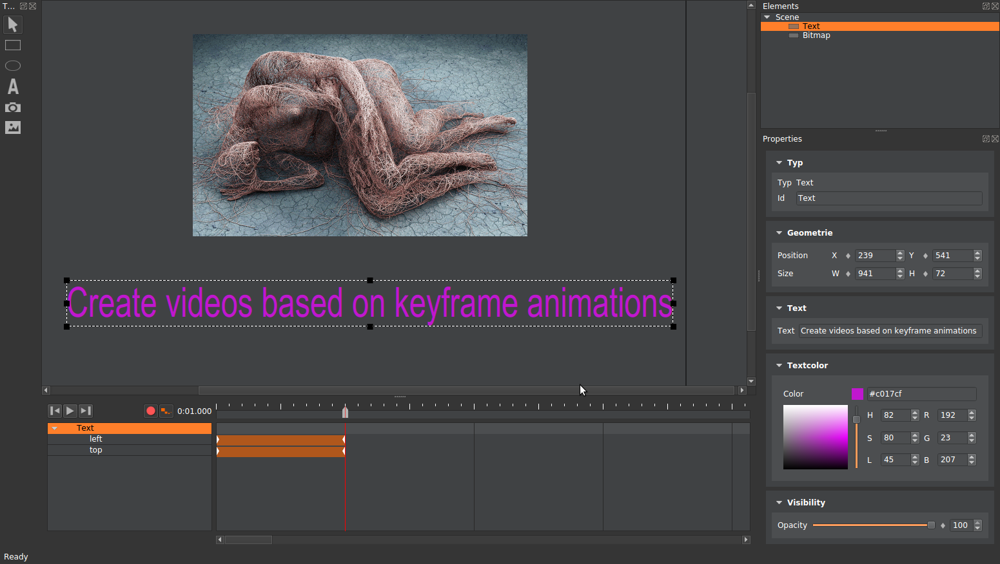

# AnimationMaker

 

AnimationMaker is a software designed to help you to quickly build presentation video which you can upload to youtube or vimeo. These presentation videos can be used as pitch videos for crowdfunding campains for example.
The idea for the AnimationMaker comes from Adobe Edge which is not available anymore.

See a video to see basic usage at [youtube](https://www.youtube.com/watch?v=Ir7Lvd-O2aE).

